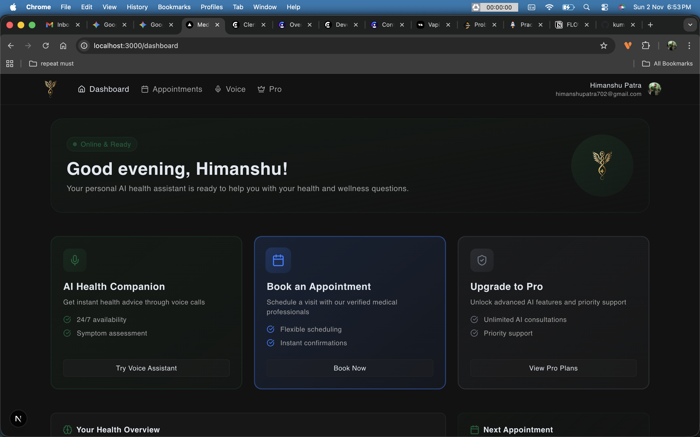

# MediCore - AI Health Companion



MediCore is a full-stack web application that allows users to get instant health advice from an AI-powered voice assistant and book appointments with doctors. It features a user-friendly interface, a secure authentication system, and an admin dashboard for managing practitioners.

---

## ✨ Features

- **AI Voice Assistant:** Have natural voice conversations with an AI Health Companion for instant advice.
- **Appointment Booking:** A multi-step booking process to schedule appointments with available doctors.
- **User Authentication:** Secure user registration and login provided by Clerk.
- **Admin Dashboard:** A protected route for administrators to manage doctors and view platform statistics.
- **Subscription Plans:** Integration with Clerk's billing to provide different subscription tiers (Free, AI Pro).
- **Dark Mode:** The UI is fully compatible with both light and dark modes.

## 🛠️ Tech Stack

- **Framework:** [Next.js](https://nextjs.org/)
- **Language:** [TypeScript](https://www.typescriptlang.org/)
- **Database:** [PostgreSQL](https://www.postgresql.org/) with [Prisma](https://www.prisma.io/) as the ORM.
- **Authentication:** [Clerk](https://clerk.com/)
- **UI:** [Tailwind CSS](https://tailwindcss.com/) with [shadcn/ui](https://ui.shadcn.com/)
- **AI Voice:** [Vapi](https://vapi.ai/)
- **State Management:** [TanStack Query (React Query)](https://tanstack.com/query/latest)
- **Deployment:** [Vercel](https://vercel.com/)

## 🚀 Getting Started

Follow these instructions to get a copy of the project up and running on your local machine for development and testing purposes.

### Prerequisites

- Node.js (v18 or later)
- npm, yarn, or pnpm
- A PostgreSQL database

### 1. Clone the Repository

```bash
git clone https://github.com/your-username/medicore.git
cd medicore
```

### 2. Install Dependencies

```bash
npm install
```

### 3. Set Up Environment Variables

Create a new file named `.env` in the root of your project and add the following variables. You will need to get these keys from the respective services (Clerk, Vapi, and your database provider).

```
# Database
DATABASE_URL="your_postgresql_database_url"

# Clerk Authentication
NEXT_PUBLIC_CLERK_PUBLISHABLE_KEY="your_clerk_publishable_key"
CLERK_SECRET_KEY="your_clerk_secret_key"

# Vapi AI Voice Assistant
NEXT_PUBLIC_VAPI_API_KEY="your_vapi_api_key"
NEXT_PUBLIC_VAPI_ASSISTANT_ID="your_vapi_assistant_id"

# Admin User
ADMIN_EMAIL="your_admin_email@example.com"

# App URL
NEXT_PUBLIC_APP_URL="http://localhost:3000"
```

### 4. Run Database Migrations

Run the following command to sync your Prisma schema with your database:

```bash
npx prisma migrate dev
```

### 5. Run the Development Server

Now, you can start the development server:

```bash
npm run dev
```

Open [http://localhost:3000](http://localhost:3000) with your browser to see the result.

## ☁️ Deployment

The easiest way to deploy this application is to use [Vercel](https://vercel.com/).

1.  Push your code to a GitHub repository.
2.  Import the repository into Vercel.
3.  Add the environment variables from your `.env` file to the Vercel project settings.
4.  Deploy!